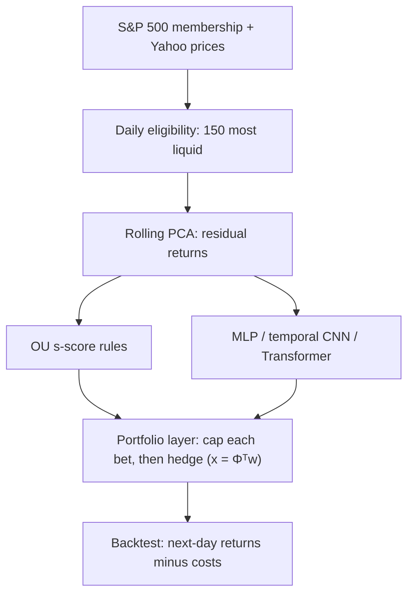
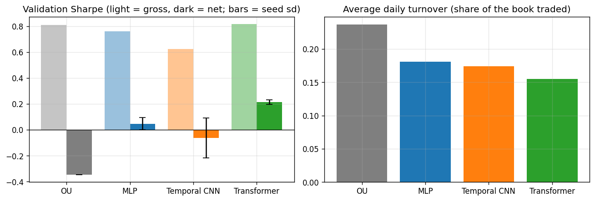
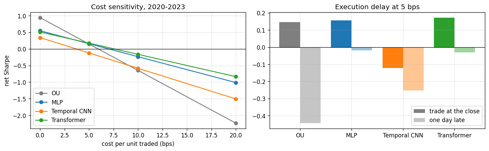

# Sharpee: cost-aware deep learning for statistical arbitrage

A research framework that compares a classical mean-reversion strategy with neural trading models on US equities. The neural models are trained to maximize the **portfolio's Sharpe ratio after transaction costs**, not to forecast prices. Everything is evaluated walk-forward, with no look-ahead.

> **Status: research complete (Phases 1-3), dashboard and report built (Phase 4a).** Data pipeline, factor residuals, OU baseline, backtester, three neural models trained on Sharpe after costs, a pre-registered test on the sealed 2020–2023 years, a one-shot 2024–25 holdout, an interactive dashboard and a [research report](reports/research_report.md). Live paper trading with GitHub Actions and MLflow tracking come next (Phase 4b).

**Built with:** Python, PyTorch, NumPy, pandas, SciPy, Streamlit, Plotly, pytest, Jupyter.

**Read more:** [research report](reports/research_report.md) · [findings, figure by figure](reports/README.md) · [interactive dashboard](#interactive-dashboard)

## At a glance

| | Result so far |
|---|---|
| **Universe** | The 150 most liquid point-in-time S&P 500 stocks each day, 2010–2025 |
| **Classic baseline (OU)**, test years 2020–2023 | Sharpe 0.94 before costs, 0.15 after 5 bps costs |
| **Best neural model (Transformer)**, validation 2018–2019 | Net Sharpe +0.21 vs. OU's −0.35, with a third less trading |
| **Pre-registered test, 2020–2023** | No reliable edge after costs: Transformer +0.17 vs. OU +0.15 net Sharpe, not statistically distinguishable |
| **One-shot holdout, 2024–2025** | Every strategy lost as residual reversion broke down; the learned models lost far less (Transformer −0.55 vs. OU −1.65) |
| **What held up** | Training on costs beat the same model without them in every seed; the learned models degrade about half as fast as OU with higher costs or a one-day delay |
| **Market exposure** | Beta ≈ 0 for every strategy |
| **Correctness** | 53 tests, a look-ahead test and a synthetic sanity check; 3 bugs caught and fixed |

## How it works



1. **Remove what the market and sectors did.** Each stock's daily return is split into a part explained by 5 PCA factors and a stock-specific **residual**.
2. **Bet that residuals snap back.** The OU baseline uses fixed rules. The neural networks learn their own rule from each stock's last 30 days of residual moves.
3. **Hold hedged positions.** Every bet is long the stock and short its factor exposure, so the portfolio stays market-neutral.
4. **Charge realistic costs.** Weights set at the close earn the next day's return minus 5 bps per unit traded. The networks are trained on exactly this after-cost result.

## Phase 1: data and baseline

| Component | What it does |
|---|---|
| **Point-in-time universe** | Uses historical S&P 500 membership (884 tickers, 2008–2025), not today's constituents. Eligibility is decided day by day: index member, enough history, price > $5, top 150 by dollar volume. |
| **Rolling PCA residuals** | Monthly refits remove 5 market/sector factors. The residual is `ε = Φ R` with `Φ = I − B Qᵀ`, estimated only from data before each decision date. |
| **OU baseline** | Avellaneda–Lee (2010): fits an AR(1) to 60-day cumulative residuals, trades on the s-score, and only trades stocks with a short mean-reversion half-life. |
| **Factor-hedged portfolio** | One shared layer maps residual positions to stock weights `x = Φᵀw` (each position is long the stock, short its factor hedge). Each residual bet is capped at 2% *before* hedging, so the cap can't break the hedge, and gross exposure is at most 1. Every strategy uses it. |
| **Cost-aware backtester** | Weights set at close *t* earn the *t → t+1* return. Costs are charged per unit of traded notional (0–20 bps), and a one-day execution-delay check is built in. |
| **Walk-forward folds** | Expanding training window, 2-year validation, yearly test, 30-day embargoes. 2024–25 is a holdout that gets run once, at the end. |

### Phase 1 results: OU baseline on the test years 2020–2023

OU has no trained parameters (it uses the published Avellaneda–Lee thresholds), so it can be reported on the test years already. The neural models are only evaluated there in Phase 3.

Before trading, the residuals pass these checks:

| Check | Raw returns | Residuals |
|---|---|---|
| Mean \|correlation\| with the market | 0.61 | **0.06** |
| Share of raw return variance remaining | 100% | 43% |
| Median OU half-life | — | 8.5 trading days |

Strategy performance:

| Cost per unit traded | Ann. return | Ann. vol | Sharpe | Max drawdown |
|---|---|---|---|---|
| 0 bps | 3.6% | 3.8% | **0.94** | −4.9% |
| 5 bps | 0.6% | 3.8% | **0.15** | −8.0% |
| 10 bps | −2.4% | 3.8% | −0.65 | −14.4% |
| 0 bps, 1-day delay | 1.3% | 3.7% | 0.36 | −6.2% |


- **The mean-reversion signal is real but small.** The strategy trades about 24% of the book per day, so 5 bps costs take most of its gross return and 10 bps take all of it. This matches the documented decline of classical stat arb.
- **The edge decays within a day.** Most of it disappears with a one-day execution delay.
- **Market exposure is low:** beta is 0.05.
- **This set the question for Phase 2:** can a model keep the edge while trading less?

## Phase 2: neural models

| Component | What it does |
|---|---|
| **Three scoring models** | An MLP, a temporal CNN (dilated 1-D convolutions) and a compact Transformer whose encoder blocks are reused from my transformer-from-scratch project. Each reads a stock's last 30 days of cumulative residual and outputs one score. |
| **Sharpe-after-costs training** | A training example is a block of 64 consecutive days × all 150 stocks. Scores go through the same portfolio layer and cost model as OU, and the loss is the negative Sharpe ratio of the portfolio's daily returns after 5 bps costs. Gradients flow through `Φᵀw`, the cap and the costs, so trading too much is penalized directly. |
| **Fold 1 tuning only** | A small grid per model (15 configurations in total, including OU's threshold), trained on 2010–2017 and validated on 2018–2019 with early stopping. Every configuration tried is logged; the Deflated Sharpe Ratio uses that count in Phase 3. The 2020–2023 test years stay sealed. |
| **Seed check** | Each model's best configuration is retrained with 3 random seeds, so a lucky initialization can't pass for a better model. |

### Phase 2 results: validation 2018–2019, 3 seeds per model

| Strategy | Gross Sharpe | Net Sharpe, 5 bps | Turnover per day | Beta |
|---|---|---|---|---|
| OU baseline | 0.81 | −0.35 | 23.7% | 0.00 |
| MLP | 0.76 | +0.05 ± 0.05 | 18.1% | 0.00 |
| Temporal CNN | 0.62 | −0.06 ± 0.15 | 17.4% | −0.01 |
| **Transformer** | **0.82** | **+0.21 ± 0.02** | **15.5%** | 0.00 |



- **Same signal, less trading.** The Transformer matches OU's gross Sharpe with about a third less turnover. That turns OU's loss after costs into a profit, consistently across seeds, and breaks even at about 7 bps against OU's 3.5.
- **The networks learned a rule OU can't express.** All three independently learned to bet on reversion for moderate residual moves and on *continuation* for extreme ones, which are often news-driven ([details](reports/README.md#14-what-the-networks-learned-revert-small-moves-follow-big-ones)).
- **Not yet evidence.** These are validation numbers that were also used to choose configurations, and one Sharpe over 473 days has a standard error of about 0.7. Phase 3's sealed test years and the Deflated Sharpe Ratio decide.

**Why everything is built this way:** [reports/README.md](reports/README.md) walks through 14 figures from both phases (data coverage, fat tails, factor structure, residual autocorrelation, half-lives, costs, training stability, turnover, what the networks learned) and the design decision each one supports.

## Phase 3: the sealed test years, 2020–2023

The rules were committed in [`docs/phase3_protocol.md`](docs/phase3_protocol.md) **before** any test-year model result existed. Each neural model was retrained every year (walk-forward) with frozen settings and 3 seeds, and the Transformer was named the primary candidate in advance.

| Pre-registered rule for the Transformer | Result | Needed | Outcome |
|---|---|---|---|
| 1. Edge after costs (Probabilistic Sharpe Ratio) | 0.64 | ≥ 0.95 | fail |
| 2. Survives 15 configurations tried (Deflated Sharpe Ratio) | 0.24 | ≥ 0.95 | fail |
| 3. Beats OU (paired bootstrap Sharpe difference) | +0.03, 95% CI −0.84 to +0.98 | interval excludes 0 | fail |

**Verdict: no reliable edge after costs.**

| Net Sharpe, 2020–2023 | 0 bps | 5 bps | 10 bps | 20 bps | 5 bps, one day late | Turnover per day |
|---|---|---|---|---|---|---|
| OU | **0.94** | 0.15 | −0.65 | −2.24 | −0.44 | 23.8% |
| MLP | 0.55 | 0.16 | −0.23 | −1.01 | −0.02 | 19.0% |
| Temporal CNN | 0.34 | −0.12 | −0.58 | −1.50 | −0.25 | 20.8% |
| **Transformer** | 0.51 | **0.17** | **−0.16** | **−0.83** | **−0.03** | **15.6%** |



- **No winner at 5 bps.** The Transformer earns +0.17 against OU's +0.15, and with only four years of data the intervals are about 1.8 Sharpe points wide.
- **The learned models are far more robust.** OU has the strongest raw signal but needs cheap, immediate execution. The Transformer trades a third less, so it degrades about half as fast as costs rise and barely notices a one-day delay.
- **Costs in the loss work.** Retraining the same Transformer without costs in its loss made it worse in every seed (combined +0.17 vs −0.08) and raised turnover from 15.6% to 23.7%.
- **The learned rule holds out of sample:** revert moderate residual moves, follow extreme ones.
- **One seed broke in one year.** Seed 0's 2023 model never trained past its starting point and lost heavily; the protocol keeps it in.

### The one-shot holdout, 2024–2025

Run once, after all of the above was committed, with the same frozen settings:

| Net Sharpe, 5 bps | OU | MLP | Temporal CNN | Transformer |
|---|---|---|---|---|
| 2024–2025 | −1.65 | −0.48 | −0.78 | **−0.55** |

Every strategy lost, even before costs: residual mean reversion broke down in 2024, when the first factor's share of variance hit multi-year lows and stocks kept trending on their own stories. The learned models lost far less than OU, helped by trading less and by following extreme moves instead of fading them. The verdict is again **no reliable edge after costs**.

Full details: [findings write-up](reports/README.md#phase-3-the-sealed-test-years-2020-2023) and [notebook 04](notebooks/04_results.ipynb).

## Interactive dashboard

A dark-themed Streamlit app with a top navigation bar lets anyone explore the results without running the research. A control strip under the bar switches between the 2020–2023 test years and the 2024–2025 holdout and sets the trading cost for every page:

- **Overview:** the pre-registered verdict, headline numbers and confidence intervals.
- **Strategies:** equity, drawdown, Sharpe vs cost and by year, and a one-day execution-delay toggle. The **cost slider** recomputes every number exactly (costs are linear in traded notional).
- **Risk:** rolling beta, net exposure and turnover, the ongoing check that every book stays market-neutral.
- **Signal:** pick any stock to see its s-score with OU's trades and each network's scores, plus the learned rule and Transformer attention.
- **Integrity:** the protocol, all 15 configurations tried, the costs-in-loss ablation, and the bugs the checks caught.

It reads only small result files in `reports/` (no models or price data), so it loads instantly:

```bash
pip install -r app/requirements.txt
streamlit run app/dashboard.py
```

To host it for free, deploy the repository on [Streamlit Community Cloud](https://share.streamlit.io) with `app/dashboard.py` as the entry point; it installs the light `app/requirements.txt`.

## How correctness is verified

- **Look-ahead test:** scramble every price after a cutoff date, rebuild the whole pipeline, and assert that every residual, signal, weight and model score on or before the cutoff is unchanged.
- **Synthetic sanity check:** with planted mean reversion, OU and all three networks must win (net Sharpe +19 to +22). With pure random-walk residuals, none may earn anything (net Sharpe at or below zero). Networks are scored on a held-out segment, so a lucky validation period can't pass.
- **66 unit tests:** hand-worked P&L, cost and timing examples; the residual identity `wᵀ(ΦR) = (Φᵀw)ᵀR`; eligibility rules; portfolio constraints, including that the capped book stays factor-neutral; the loss and its gradients; metrics; PSR, DSR and bootstrap intervals against hand-computed values; and the dashboard's numbers against the official Phase 3 results.

### What the checks caught

1. **NaN training blocks.** Random cut points occasionally produced a 1-day training block, whose Sharpe is undefined, and the NaN silently poisoned the model weights. The synthetic check flagged it, because every network scored exactly 0. Blocks are now at least 32 days, and a broken return series reports NaN instead of 0.
2. **A cap that broke the hedge.** The 2% cap was first applied to stock weights *after* hedging, which cut a stock's leg but kept its hedge legs. The MLP learned to exploit this: its portfolio became 80–90% correlated with the S&P 500, and its apparent edge was really riding the 2010–2019 bull market. The cap now applies to residual bets before hedging. A regression test fails under the old order and passes under the new one.
3. **A collapsed model.** Removing score centering let a constant output act as an equal-weight bet on every residual at once, and the networks collapsed onto it (every Transformer configuration scored the same Sharpe). Model scores are centered again, so a constant output now holds no position.

Each bad run is archived, not deleted, and excluded from the trial log.

## Run it

Python 3.10+, in a virtual environment:

```bash
pip install -r requirements.txt
pip install -e .
python scripts/download_data.py      # membership + Yahoo prices -> data/ (about 10 min)
python scripts/run_baseline.py       # OU baseline -> reports/
python scripts/sanity_synthetic.py   # pipeline check on synthetic markets
python scripts/run_baseline.py --tune                     # OU threshold on Fold 1 validation
python scripts/train_model.py --model transformer --tune  # same for mlp and temporal_cnn; --resume skips logged configs
python scripts/walk_forward.py --model transformer        # yearly retraining on 2020-2023 (also mlp, temporal_cnn; --no-cost for the ablation)
python scripts/run_backtest.py                           # test-year results, significance tests and the verdict
python scripts/export_dashboard.py                       # small result files for the dashboard
streamlit run app/dashboard.py
pytest
```

The notebooks run top to bottom with the project's environment, e.g. `python -m nbconvert --to notebook --execute --inplace notebooks/04_results.ipynb`.

## Repository layout

```
app/              Streamlit dashboard and its data layer
configs/          data, experiment, OU baseline and model settings (YAML)
docs/             full project plan (v2) and the pre-registered Phase 3 protocol
src/sharpee/
  data/           universe, download, cleaning + eligibility, synthetic markets
  features/       returns, rolling PCA residuals, diagnostics
  strategies/     OU / s-score baseline
  portfolio/      shared weight construction and exposure diagnostics
  backtest/       accounting and costs, backtest engine
  models/         MLP, temporal CNN, Transformer (+ vendored encoder blocks)
  training/       day-block dataset, Sharpe-after-costs loss, training loop, trial log, tuning
  evaluation/     metrics, walk-forward folds, significance tests (PSR, DSR, bootstrap), strategy books
notebooks/        01 data exploration, 02 residual analysis, 03 model training, 04 results (outputs saved, readable on GitHub)
scripts/          download_data, run_baseline, train_model, walk_forward, run_backtest, export_dashboard, sanity_synthetic
tests/            66 tests, including the look-ahead test
reports/          research report, findings write-up, figures, Phase 3 results and dashboard data
```

## Roadmap

1. ~~**Data and baseline:** universe, residuals, OU, backtester, tests~~ ✅
2. ~~**Neural models:** MLP, temporal CNN and a compact Transformer, trained end-to-end on Sharpe after costs and tuned on Fold 1 only, with every configuration logged~~ ✅
3. ~~**Evaluation:** a pre-registered protocol, yearly walk-forward retraining on 2020–2023, significance tests, cost and delay sensitivity, the costs-in-loss ablation, and the one-shot 2024–25 holdout~~ ✅
4. **Delivery:**
   - ~~**4a:** interactive Streamlit dashboard and research report~~ ✅
   - **4b:** live paper-trading tracker (a daily GitHub Actions job runs the frozen models after the close and records an out-of-sample track record) and MLflow experiment tracking.

## Limitations

- **Survivorship bias remains.** Yahoo has no prices for 250 of the 884 historical members, mostly delisted or acquired companies. Coverage rises from 67% of index members in 2008 to 98% in 2025, so results are likely biased upward.
- **Some tickers are reused.** A few delisted symbols (e.g. `CPWR`) now belong to unrelated securities on Yahoo. The price and liquidity filters keep all of them out of the tradable universe; [notebook 01](notebooks/01_data_exploration.ipynb) shows the check.
- **Simplified execution.** Trades happen at the closing price, costs are a flat proportional rate, and weights don't drift between daily rebalances.
- **Simplified relative to Avellaneda–Lee.** PCA factors are refit monthly rather than daily, and the s-score has no drift adjustment.
- **Short samples.** Phase 2 compares strategies on two validation years and Phase 3 on four test years. At this length, Sharpe ratios within about one point of each other can't be told apart statistically.

## References

- Avellaneda & Lee (2010), *Statistical Arbitrage in the U.S. Equities Market*
- Guijarro-Ordonez, Pelger & Zanotti (2021), *Deep Learning Statistical Arbitrage* ([arXiv:2106.04028](https://arxiv.org/abs/2106.04028))
- Bailey & López de Prado (2014), *The Deflated Sharpe Ratio*

*Research and educational project; not investment advice.*
