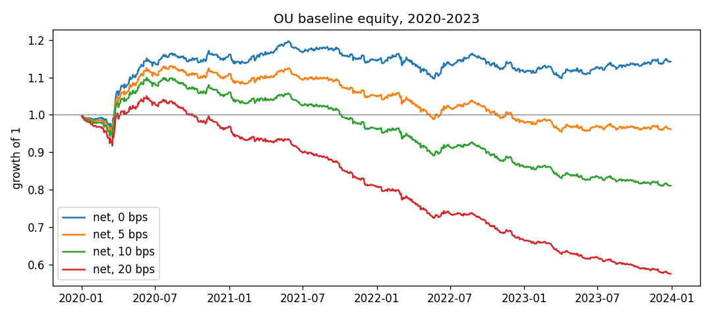

# Sharpee: cost-aware deep learning for statistical arbitrage

A research framework that compares a classical mean-reversion strategy with neural trading models on US equities. The neural models are trained to maximize the **portfolio's Sharpe ratio after transaction costs**, not to forecast prices. Everything is evaluated walk-forward, with no look-ahead.

> **Status: Phase 1 of 4 complete.** The data pipeline, factor residuals, classical baseline, backtester and tests are done. Neural models are next (see [Roadmap](#roadmap)).

## What Phase 1 delivers

| Component | What it does |
|---|---|
| **Point-in-time universe** | Uses historical S&P 500 membership (884 tickers, 2008–2025), not today's constituents. Eligibility is decided day by day: index member, enough history, price > $5, top 150 by dollar volume. |
| **Rolling PCA residuals** | Monthly refits remove 5 market/sector factors. The residual is `ε = Φ R` with `Φ = I − B Qᵀ`, estimated only from data before each decision date. |
| **OU baseline** | Avellaneda–Lee (2010): fits an AR(1) to 60-day cumulative residuals, trades on the s-score, and only trades stocks with a short mean-reversion half-life. |
| **Factor-hedged portfolio** | One shared layer maps residual positions to stock weights `x = Φᵀw` (each position is long the stock, short its factor hedge), with gross exposure 1 and a 2% single-name cap. Every strategy uses it. |
| **Cost-aware backtester** | Weights set at close *t* earn the *t → t+1* return. Costs are charged per unit of traded notional (0–20 bps), and a one-day execution-delay check is built in. |
| **Walk-forward folds** | Expanding training window, 2-year validation, yearly test, 30-day embargoes. 2024–25 is a holdout that gets run once, at the end. |

## First results: OU baseline, out-of-sample 2020–2023

Before trading, the residuals pass these checks:

| Check | Raw returns | Residuals |
|---|---|---|
| Mean \|correlation\| with the market | 0.61 | **0.06** |
| Share of raw return variance remaining | 100% | 43% |
| Median OU half-life | — | 8.5 trading days |

Strategy performance:

| Cost per unit traded | Ann. return | Ann. vol | Sharpe | Max drawdown |
|---|---|---|---|---|
| 0 bps | 3.5% | 5.0% | **0.70** | −8.4% |
| 5 bps | −0.8% | 5.0% | **−0.17** | −15.7% |
| 0 bps, 1-day delay | 1.1% | 4.9% | 0.23 | −8.5% |



**Reading the results:**
- **The mean-reversion signal is real but small.** The strategy trades about 34% of the book per day, so at 5 bps costs exceed its gross return. This matches the documented decline of classical stat arb.
- **The edge decays within a day.** Most of it disappears with a one-day execution delay.
- **This is the bar for Phase 2.** The neural models have to keep the edge while trading less, so it survives costs.
- **Market exposure is low:** beta is 0.04.

**Why the strategy is built this way:** [reports/README.md](reports/README.md) walks through ten figures (data coverage, fat tails, factor structure, residual autocorrelation, half-lives, costs) and the design decision each one supports.

## How correctness is verified

- **Look-ahead test:** scramble every price after a cutoff date, rebuild the whole pipeline, and assert that every residual, signal and weight on or before the cutoff is unchanged.
- **Synthetic sanity check:** with planted mean reversion, OU must win (Sharpe +12.9). With pure random-walk residuals, it must earn nothing (Sharpe −0.03).
- **33 unit tests:** hand-worked P&L, cost and timing examples; the residual identity `wᵀ(ΦR) = (Φᵀw)ᵀR`; eligibility rules; portfolio constraints; metrics.

## Run it

Python 3.10+, in a virtual environment:

```bash
pip install -r requirements.txt
pip install -e .
python scripts/download_data.py      # membership + Yahoo prices -> data/ (about 10 min)
python scripts/run_baseline.py       # OU baseline -> reports/
python scripts/sanity_synthetic.py   # pipeline check on synthetic markets
pytest
```

## Repository layout

```
configs/          data, baseline and experiment settings (YAML)
docs/             full project plan (v2)
src/sharpee/
  data/           universe, download, cleaning + eligibility, synthetic markets
  features/       returns, rolling PCA residuals, diagnostics
  strategies/     OU / s-score baseline
  portfolio/      shared weight construction and exposure diagnostics
  backtest/       accounting and costs, backtest engine
  evaluation/     metrics, walk-forward folds
notebooks/        01 data exploration, 02 residual analysis (outputs saved, readable on GitHub)
scripts/          download_data, run_baseline, sanity_synthetic
tests/            33 tests, including the look-ahead test
reports/          results tables, figures and the Phase 1 findings write-up
```

## Roadmap

1. ~~**Data and baseline:** universe, residuals, OU, backtester, tests~~ ✅
2. **Neural models:** MLP and a compact Transformer (encoder reused from my transformer-from-scratch project), trained end-to-end on Sharpe after costs. Every configuration tried is logged.
3. **Evaluation:** yearly walk-forward retraining, cost and delay sensitivity, ablations, and significance tests: Probabilistic and Deflated Sharpe Ratio (the latter adjusts for the number of configurations tried) and block-bootstrap confidence intervals. Then the one-shot 2024–25 holdout.
4. **Delivery:** Streamlit dashboard and research report.

## Limitations

- **Survivorship bias remains.** Yahoo has no prices for 250 of the 884 historical members, mostly delisted or acquired companies. Coverage rises from 67% of index members in 2008 to 98% in 2025, so results are likely biased upward.
- **Some tickers are reused.** A few delisted symbols (e.g. `CPWR`) now belong to unrelated securities on Yahoo. The price and liquidity filters keep all of them out of the tradable universe; [notebook 01](notebooks/01_data_exploration.ipynb) shows the check.
- **Simplified execution.** Trades happen at the closing price, costs are a flat proportional rate, and weights don't drift between daily rebalances.
- **Simplified relative to Avellaneda–Lee.** PCA factors are refit monthly rather than daily, and the s-score has no drift adjustment.

## References

- Avellaneda & Lee (2010), *Statistical Arbitrage in the U.S. Equities Market*
- Guijarro-Ordonez, Pelger & Zanotti (2021), *Deep Learning Statistical Arbitrage* ([arXiv:2106.04028](https://arxiv.org/abs/2106.04028))
- Bailey & López de Prado (2014), *The Deflated Sharpe Ratio*

*Research and educational project; not investment advice.*
