# Findings: the evidence behind Sharpee's design

Each figure below comes from the notebooks ([01 data exploration](../notebooks/01_data_exploration.ipynb), [02 residual analysis](../notebooks/02_residual_analysis.ipynb), [03 model training](../notebooks/03_train_models.ipynb)) or from `scripts/run_baseline.py`, and rerunning them regenerates it. Every section covers what the data shows and which design decision it justifies. Sections 1-10 are Phase 1 (data and baseline); sections 11-14 are Phase 2 (neural models).

---

## 1. The data is incomplete in the past, so the universe must be point-in-time

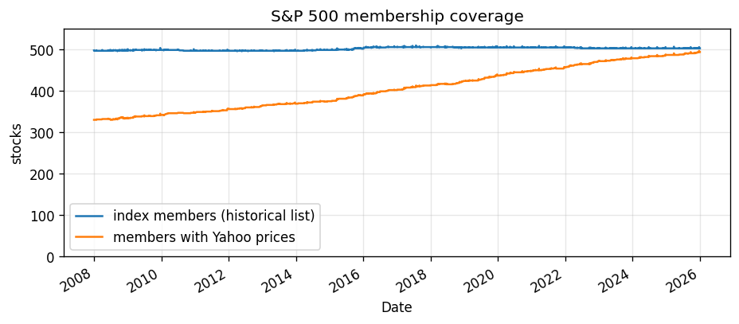

**What it shows.** The S&P 500 always has about 500 members. Yahoo has prices for only 67% of 2008's members, rising to 98% by 2025. The missing companies are the ones that later left the index: delisted, acquired or merged.

**Design decision.** Membership comes from a historical list, and eligibility is decided day by day. A full-period history filter would quietly remove every company that later disappeared. The remaining gap can't be fixed with free data, so it's disclosed as survivorship bias that likely flatters results.

---

## 2. A fixed-size, liquid universe after a warm-up period

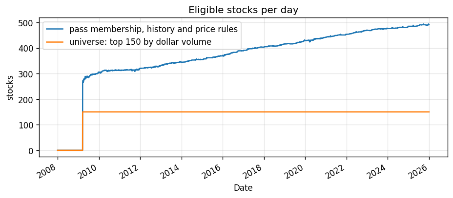

**What it shows.** Once the 312-day history requirement is met (March 2009), 300–500 stocks pass the membership, history and price rules each day. The 150 most liquid of them form the universe.

**Design decision.** 2008–2009 is used only as warm-up for the PCA and OU windows, so no trading or training happens before 2010. The universe has a constant size, which keeps every model's input the same shape. Ranking by liquidity keeps strategies in stocks they could actually trade, and it also screens out reused tickers whose Yahoo prices belong to unrelated securities (checked in notebook 01).

---

## 3. Returns are heavily fat-tailed

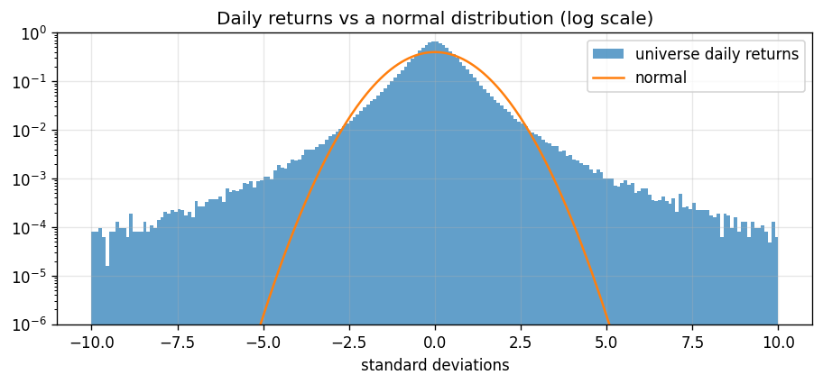

**What it shows.** Excess kurtosis is about 20. Days beyond 4 standard deviations are about 100 times more common than a normal distribution predicts.

**Design decision.** Sharpe ratios computed on fat-tailed returns are less reliable than they look. That's why Phase 3 uses the **Probabilistic and Deflated Sharpe Ratios**, which adjust for skewness and kurtosis. It's also why a 2% single-name cap stops any one stock's jump from dominating the portfolio.

---

## 4. Markets change regime

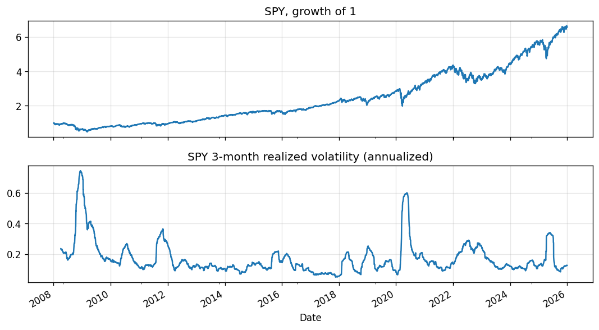

**What it shows.** Volatility spikes in 2008, 2011, 2020, 2022 and 2025, with long calm stretches in between.

**Design decision.** One backtest number can hide regime dependence, so the models are evaluated with **walk-forward retraining, one test year at a time**, and results are reported per year. 2024–2025 stays an untouched holdout.

---

## 5. Common factors explain about half of all movement

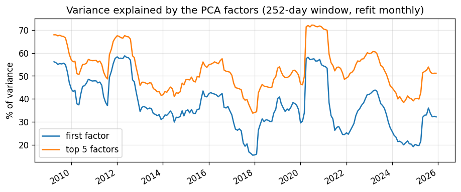

**What it shows.** The first PCA factor (roughly "the market") explains about 37% of the variance on average, and the top 5 factors about 52%. Both rise in crises, when stocks move together, and fall in calm markets.

**Design decision.** Strategies trade **residuals**: what is left after removing these factors. Because the factor structure drifts, PCA is **refit every month** using only past data. Each position is held as stock weights `x = Φᵀw`, meaning long the stock and short its factor hedge, so the portfolio stays close to factor-neutral (beta 0.04 in the baseline).

---

## 6. The core evidence: residuals mean-revert, weakly but consistently

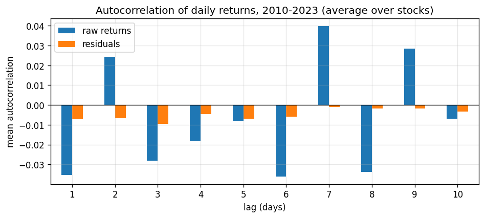

**What it shows.** Raw-return autocorrelations swing between positive and negative from lag to lag. That pattern is market-wide noise, and it disappears once the factors are removed. Residual autocorrelation is small (about −0.01) but **negative at every lag from 1 to 10 days**.

**Why this is the basis of the strategy.** A stock that drifted away from its factor-implied path tends to drift back. The effect on any single day is tiny, but it accumulates over one to two weeks. That's the signal both the OU baseline and the neural models trade. Removing factors also cut the average correlation with the market from about 0.6 to 0.02–0.06.

---

## 7. How fast reversion happens sets the windows

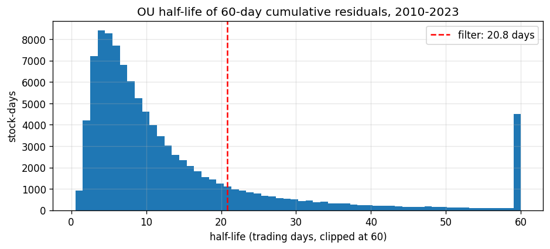

**What it shows.** OU fits on 60-day cumulative residuals revert in most cases, with a median half-life of 8.6 trading days. 83% of reverting fits are faster than 21 days.

**Design decision.** A 60-day window is long enough to estimate a reversion that takes 1–2 weeks. The baseline only trades half-lives under about 21 days (κ > 252/30). The neural models read the last 30 days, a few half-lives of history.

---

## 8. What the OU rules actually do

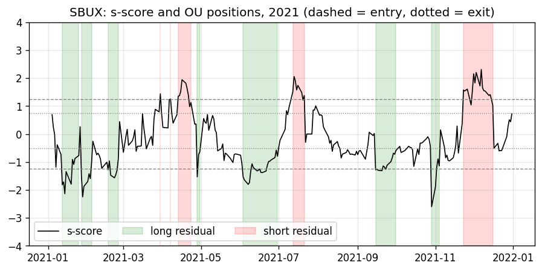

**What it shows.** Starbucks' s-score in 2021 and the baseline's positions. It goes long the residual when the s-score falls below −1.25 and exits above −0.5. It goes short above +1.25 and exits below +0.75. That's 24 position changes in one year for one stock.

**Design decision.** This is a transparent, rule-based benchmark that the neural models must beat. It also shows how often the strategy trades, which leads to the next point.

---

## 9. Trading costs come from two sources

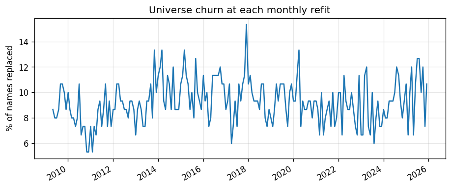

**What it shows.** About 9% of the universe is replaced at each monthly refit, and positions in names that leave are closed. On top of that, the signal itself needs frequent rebalancing.

**Design decision.** Turnover is computed in ticker space, so a stock that changes universe slot isn't counted as a trade. Costs are charged on every unit traded, and the neural models are trained on returns **after** costs.

---

## 10. The result that defines Phase 2

| OU baseline, 2020–2023 | Sharpe | Annual return | Turnover per day |
|---|---|---|---|
| Before costs | 0.94 | 3.6% | 24% |
| After 5 bps | 0.15 | 0.6% | 24% |
| After 10 bps | −0.65 | −2.4% | 24% |
| Before costs, 1-day delay | 0.36 | 1.3% | 24% |

**What it shows.** The mean-reversion signal makes money before costs. Trading 24% of the book every day, 5 bps costs take most of the gross return and 10 bps take all of it. The edge also fades quickly: most of it is gone if trades are delayed by one day.

**What comes next.** Phase 2 trains MLP, temporal CNN and Transformer models whose loss is the portfolio's **Sharpe ratio after costs**, using the same portfolio construction and backtester. The question is whether a model optimized this way can keep the signal while trading less.

---

# Phase 2: neural models on walk-forward Fold 1

All Phase 2 numbers use Fold 1 only: training on 2010-2017 and validation on 2018-2019, with a 30-day embargo before each. The 2020-2023 test years stay sealed until Phase 3. Validation days were used to pick configurations and stopping epochs, so these numbers are optimistic for every strategy, and one Sharpe estimate over 473 days has a standard error of about 0.7.

---

## 11. Every configuration tried is on the record

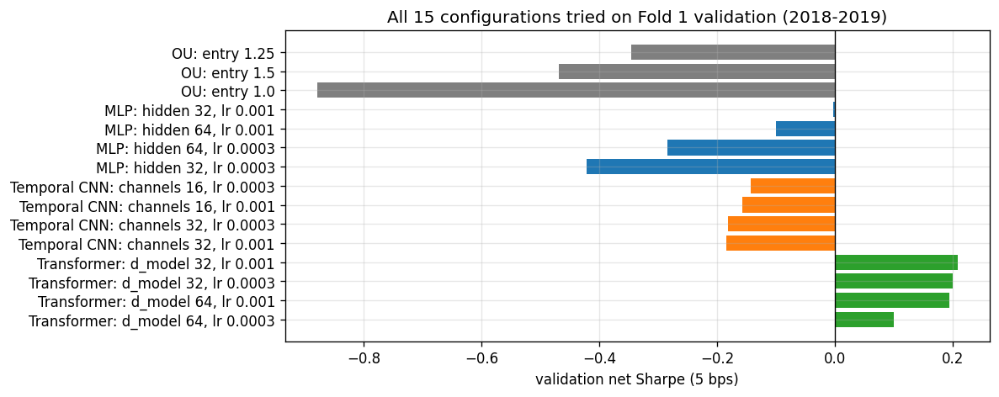

**What it shows.** A small grid per strategy: 3 OU entry thresholds, and 4 configurations each for the MLP, temporal CNN and Transformer (model size and learning rate). That's 15 in total, each logged to the trial log with its daily validation returns.

**Design decision.** The more configurations you try, the better the best one looks by luck alone. Phase 3's **Deflated Sharpe Ratio** raises the bar using exactly this count and the spread of these Sharpes. Runs from the two bugs found during Phase 2 are archived and excluded, because they came from a different, broken pipeline.

---

## 12. Training is stable once the pipeline is right

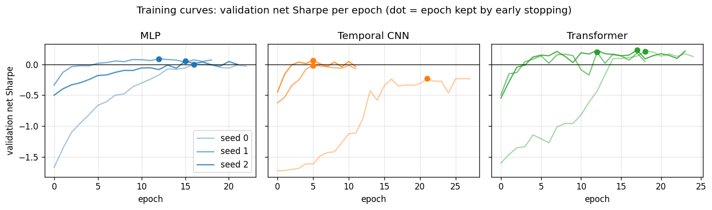

**What it shows.** Each model's selected configuration is retrained with seeds 0, 1 and 2. Validation Sharpe climbs from negative values at initialization and levels off. The Transformer is the most consistent: all three seeds settle at +0.20 to +0.23. The MLP lands near zero, and the CNN depends most on the seed (-0.23 to +0.06).

**Design decision.** Results are always reported as a mean and spread over seeds, never a single run, so that a lucky initialization can't pass for a better model.

---

## 13. Same signal, less trading

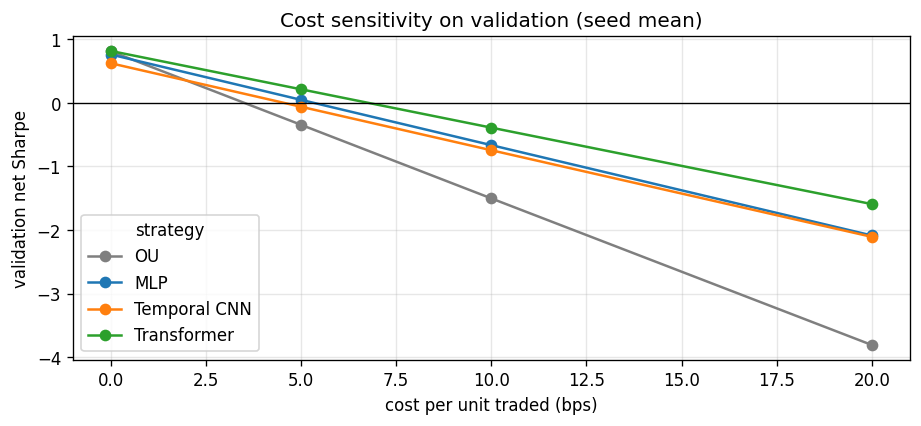

| Validation 2018-2019, 5 bps | Gross Sharpe | Net Sharpe (seed mean ± sd) | Turnover per day | Break-even cost | Beta |
|---|---|---|---|---|---|
| OU | 0.81 | -0.35 | 23.7% | ~3.5 bps | 0.00 |
| MLP | 0.76 | +0.05 ± 0.05 | 18.1% | ~5 bps | 0.00 |
| Temporal CNN | 0.62 | -0.06 ± 0.15 | 17.4% | ~4.5 bps | -0.01 |
| **Transformer** | **0.82** | **+0.21 ± 0.02** | **15.5%** | **~7 bps** | 0.00 |

**What it shows.** All four strategies earn a similar gross Sharpe, so the networks didn't find a stronger signal than OU. What changed is **how much they trade**. The Transformer keeps OU's gross edge with about a third less turnover, and at 5 bps that is the difference between losing money (-0.35) and making it (+0.21). Every network breaks even at a higher cost than OU, and every book is market-neutral.

**Design decision.** This is the case for putting **costs inside the training loss**: the models learned to trade less where trading doesn't pay. Phase 3 tests it directly with an ablation that trains the same models without costs in the loss.

---

## 14. What the networks learned: revert small moves, follow big ones

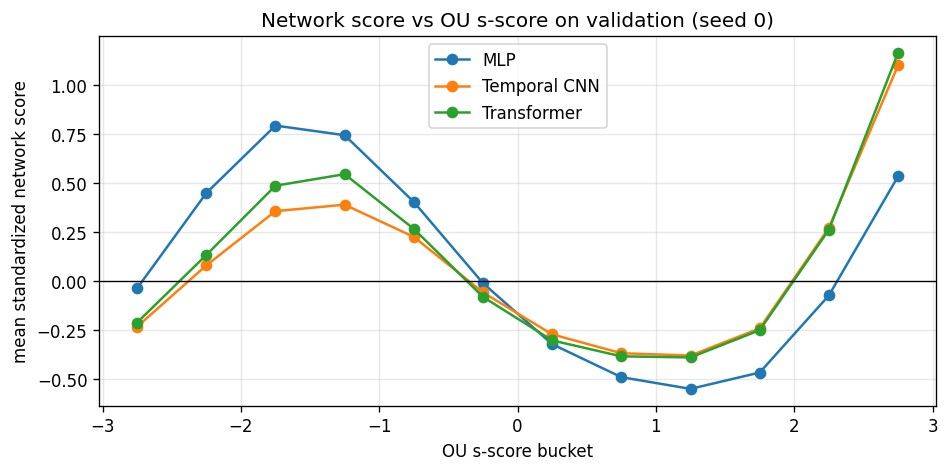

**What it shows.** Each validation stock-day is bucketed by its OU s-score (how stretched the cumulative residual is), and the networks' standardized scores are averaged per bucket. All three networks, trained independently, learned the same shape:

- **Moderate stretches (|s| below about 2): reversion**, like OU. They buy residuals that fell and sell ones that rose (rank correlation with the s-score about -0.45).
- **Extreme stretches: continuation**, strongest after large up-moves.

**Why it matters.** Large residual moves are often news, such as earnings or guidance, rather than liquidity noise, and news-driven moves tend to keep drifting instead of reverting. OU shorts every s > 1.25 regardless, so it trades against exactly those moves. The networks found a nonlinear rule that the classic model can't express, without being told to look for one.
